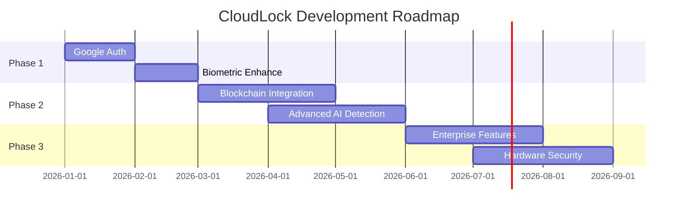

<div align="center">
  
# 🔒 **CloudLock**
### AI-Secured Password Manager
[](LICENSE)
[](https://github.com/LemonmadeDesigns/cloudlock)
[](https://cloud-lock.org)

**Securing Your Digital Identity with AI-Powered Protection**

[Website](https://cloud-lock.org) • [Documentation](#-getting-started) • [Features](#-key-features) • [Support](mailto:lemonsterrell@csu.fulllerton.edu)

</div>

---

## 📋 Overview

CloudLock is a next-generation password manager that leverages AI technology, zero-trust authentication, and multi-cloud backup to provide unprecedented security for your digital credentials. With advanced features like AI-powered phishing detection and dark web monitoring, CloudLock ensures your passwords remain secure in an increasingly complex digital landscape.

<div align="center" style="color:skyblue">


  <p><em>CloudLock Dashboard - Your Security Command Center</em></p>
</div>


## 🔐 Key Features

### 🛡️ Core Security
| Feature | Description |
|---------|-------------|
| **Zero-Trust Authentication** | Multi-layered security approach with no implicit trust |
| **End-to-End Encryption** | AES-256 and RSA-4096 encryption standards |
| **Multi-Cloud Backup** | Redundant storage across AWS, Google Cloud, and Azure |
| **Self-Destruct Mode** | Emergency credential wiping across all devices and cloud storage |

<div align="center" style="color:skyblue">


  <p><em>Advanced Security Features in Action</em></p>
</div>

### 🤖 AI-Powered Protection
- 🎯 **Intelligent Phishing Detection**: Real-time protection against malicious websites
- 💪 **Password Strength Analysis**: AI-driven password evaluation and suggestions
- 🌐 **Dark Web Monitoring**: Immediate alerts if credentials are compromised
- 🧠 **Adaptive Security**: Learning from new threat patterns

<br>
<div align="center" style="color:skyblue">


  <p><em>AI-Powered Security Analysis</em></p>
</div>

## 💡 Use Cases

<table>
<tr>
<td width="40%" style="borderr:8px double skyblue; color: skyblue; margin: 5px;">

### 👤 Individual Users
- Secure password storage and management
- Automatic strong password generation
- Cross-device synchronization
- Dark web monitoring for personal credentials
- Emergency access for trusted contacts

</td>
<td width="40%" style="border:8px double skyblue; color:skyblue">

### 🏢 Business Users
- Team password sharing and management
- Role-based access control
- Audit logging and compliance reporting
- Enterprise-grade security policies
- Integration with existing security infrastructure

</td>
</tr>
</table>

## 🚀 Getting Started

### Step 1: Sign Up
```bash
1. Visit cloud-lock.org or download the mobile app
2. Create an account with your email
3. Set up master password and MFA
4. Complete security questionnaire
```

### Step 2: First-Time Setup
```bash
1. Import existing passwords
2. Install browser extensions
3. Enable cloud backup
4. Configure security settings
```

### Step 3: Daily Usage
```bash
1. Access vault via app/extension
2. Auto-add new passwords
3. Use password generator
4. Monitor security alerts
```

## 🛡️ Security Features

<details>
<summary><b>Authentication Methods</b></summary>

- 🔑 Hardware security keys (YubiKey, FIDO2)
- ⏰ Time-based one-time passwords (TOTP)
- 📱 SMS/email verification codes

</details>

<details>
<summary><b>Emergency Access</b></summary>

- 💥 Self-destruct capability for compromised vaults
- 👥 Trusted contact recovery system
- 📴 Offline access protocols
- ⚖️ Legal compliance support

</details>

## 📱 Supported Platforms

<div align="center">

### Deployment Status

| Platform     | Status     | Link                        |
|--------------|------------|-----------------------------|
| 🌐 Web       | ✅ Ready   | [Visit Site](https://cloud-lock.org) |
| 📱 iOS       | ✅ Ready   | [App Store](#)              |
| 📱 Android   | ✅ Ready   | [Play Store](#)             |
| 💻 Windows   | ✅ Ready   | [Download](#)               |
| 💻 macOS     | ✅ Ready   | [Download](#)               |
| 💻 Linux     | ✅ Ready   | [Download](#)               |


</div>

## 🔧 Technical Stack

<div align="center">

<table>
<tr>
<td align="center"><b style="color: skyblue;">Frontend</b><br>React, Vite, Typescript</td>
<td align="center"><b style="color: skyblue;">UI/Styling</b><br>Tailwind CSS, Shadcn UI</td>
<td align="center"><b style="color: skyblue;">State Management</b><br>React Context, Tanstack Query</td>
</tr>
<tr>
<td align="center"><b style="color: skyblue;">Backend/Auth</b><br>Supabase</td>
<td align="center"><b style="color: skyblue;">AI Integration</b><br>Claude AI</td>
<td align="center"><b style="color: skyblue;">Database</b><br>PostgreSQL (via Supabase)</td>
</tr>
<tr>
<td align="center" colspan="3"><b style="color: skyblue;">Cloud Services</b><br>AWS S3, AWS Lambda, AWS CloudWatch, AWS SNS, AWS API Gateway</td>
</tr>
</table>

</div>

## 🌟 Best Practices

### Password Management
- [x] Use password generator for all new accounts
- [x] Enable MFA wherever possible
- [x] Regularly review stored credentials
- [x] Maintain unique passwords per account
- [x] Monitor security score

### Security Measures
- [x] Keep master password secure
- [x] Enable biometric authentication
- [x] Review active sessions regularly
- [x] Set up emergency access
- [x] Keep app updated

## 🚦 Future Roadmap



## 👥 Contributors

<div align="center">

### School Project Team

| Name | Role | GitHub |
|------|------|--------|
| Ryan Trinh | Developer | [@spill](#) |
| Brian Wei | Developer | [@bw4127](#) |
| Christian Ward | Developer | [@christian](#) |

</div>

## 📝 Repository and Deployment

<div align="center">

[](https://github.com/LemonmadeDesigns/cloudlock)
[](https://cloud-lock.org)

</div>

---

<div align="center">

### 🤝 Support & Contact

For support inquiries: [Support Team](mailto:lemonsterrell@csu.fulllerton.edu)

**CloudLock** © 2025 - All Rights Reserved

</div>
